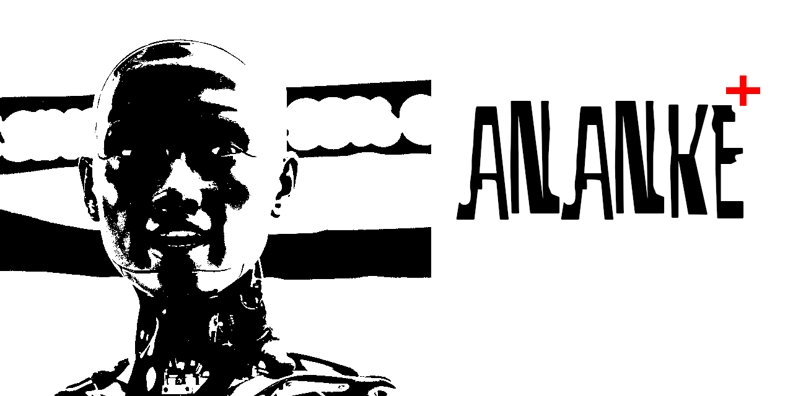

# ANANKE

<p align="center">
  
</p>

A pure, zero-dependency, high-utility Quantum Computing Simulator built entirely from scratch in C++.


## The Philosophy
No massive frameworks. No enterprise bloat. No third-party matrix libraries. `ANANKE` is built to prove that advanced computational paradigms can be simulated directly on consumer hardware using raw mathematics, clear logic, and optimized C++17 standards.

## Project Structure
*   `src/` - Core execution and implementation logic.
*   `include/` - Self-contained headers for registers, state vectors, and operators.
*   `docs/` - System architecture, development vision, roadmaps, and manual.

## Getting Started
```bash
g++ -O3 -std=c++17 src/main.cpp -o ananke_sim
./ananke_sim
```
